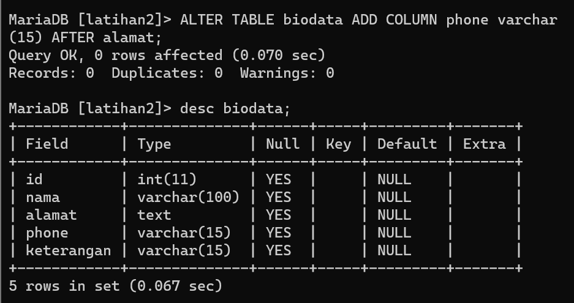
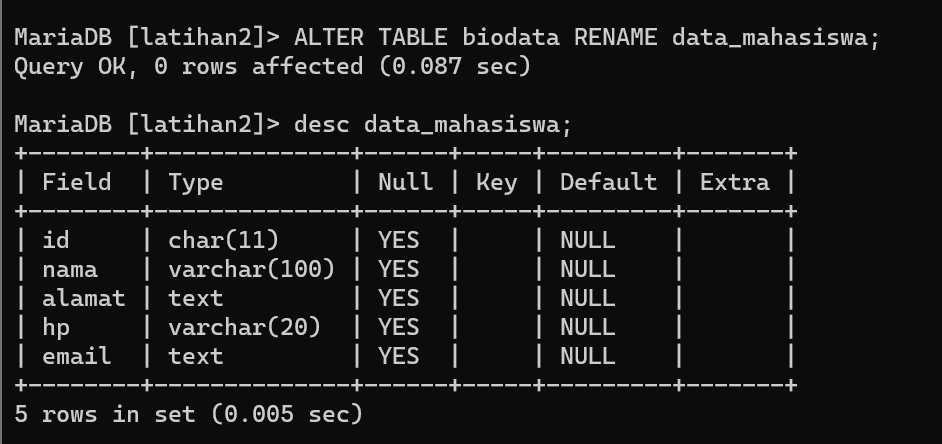

# PRAKTIKUM 1

1. Buat sebuah database dengan nama latihan2!

2. Buat sebuah tabel dengan nama biodata (nama, alamat) didalam database latihan1!

3. Tambahkan sebuah kolom keterangan (varchar 15), sebagai kolom terakhir!

4. Tambahkan kolom id (int 11) di awal (sebagai kolom pertama)!

5. Sisipkan sebuah kolom dengan nama phone (varchar 15) setelah kolom alamat!

6. Ubah tipe data kolom id menjadi char(11)!

7. Ubah nama kolom phone menjadi hp (varchar 20)!

8. Tambahkan kolom email setelah kolom hp

9. Hapus kolom keterangan dari tabel!

10. Ganti nama tabel menjadi data_mahasiswa!

11. Ganti nama field id menjadi nim!

12. Jadikan nim sebagai PRIMARY KEY!

13. Jadikan kolom email sebagai UNIQUE KEY

* 
int(11) adalah tipe data integer dan memiliki panjang 11 karakter

* 
Jika kolom "NULL" memiliki nilai "YES", artinya kolom tersebut diizinkan untuk berisi nilai "NULL". Ini berarti bahwa kolom tersebut tidak harus diisi dengan nilai tertentu saat melakukan operasi INSERT atau UPDATE pada tabel.

Jika kolom "NULL" memiliki nilai "NO", artinya kolom tersebut tidak diizinkan untuk berisi nilai "NULL". Ini berarti bahwa kolom tersebut harus diisi dengan nilai tertentu saat melakukan operasi INSERT atau UPDATE pada tabel. Jika kita mencoba melakukan operasi INSERT atau UPDATE tanpa menyediakan nilai untuk kolom yang tidak diizinkan "NULL", maka MySQL akan menghasilkan kesalahan dan operasi tersebut akan gagal.
